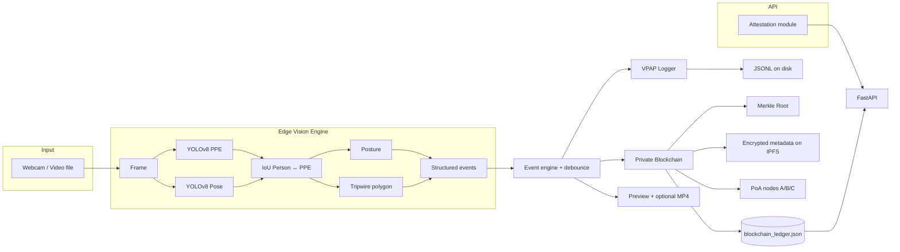

# PoseVision — Secure Edge AI Surveillance Node

Production-oriented edge pipeline that combines **YOLOv8 PPE detection**, **YOLOv8 pose estimation**, **person–gear association**, **virtual tripwire (intrusion)**, **posture-based fall cues**, **tamper-evident logging (VPAP)**, **model/script attestation**, and a small **FastAPI** service for events and integrity reporting.

Designed for **near–real-time** inference: **one forward pass per model per frame** (no redundant YOLO calls).

---

## Table of contents

- [Features](#features)
- [Architecture](#architecture)
- [Repository layout](#repository-layout)
- [Requirements](#requirements)
- [Installation](#installation)
- [Models](#models)
- [Configuration](#configuration)
- [Running the pipeline](#running-the-pipeline)
- [HTTP API](#http-api)
- [Logging (VPAP)](#logging-vpap)
- [Blockchain Audit Layer](#blockchain-audit-layer)
- [Attestation](#attestation)
- [Privacy](#privacy)
- [Structured events](#structured-events)
- [Legacy / test scripts](#legacy--test-scripts)
- [Troubleshooting](#troubleshooting)
- [License](#license)

---

## Features

| Capability | Description |
|------------|-------------|
| **Dual YOLO** | PPE detector + pose model on each frame |
| **Person–PPE association** | IoU overlap between each **Person** box and PPE classes (helmet / vest signals) |
| **Pose linkage** | Best IoU match between person box and pose detection for keypoints |
| **Posture** | Torso angle → Standing / Sitting / Lying (fall-related) |
| **Tripwire** | Closed polygon + `cv2.pointPolygonTest` on person center → intrusion flag |
| **RFID + RBAC** | MFRC522/ESP32 tag scan authorizes intruders per zone → `AUTHORIZED_ACCESS` vs `ZONE_VIOLATION` / `UNKNOWN_RFID` / `UNAUTHORIZED_INTRUSION` (see [docs/rfid_access_control.md](docs/rfid_access_control.md)) |
| **Event engine** | Debounced alerts: `NO_HELMET`, `NO_VEST`, `INTRUSION`, `FALL_DETECTED`, plus RFID access decisions |
| **VPAP logs** | SHA-256 chained JSON Lines (`prev_hash` → `current_hash`) |
| **Blockchain audit** | Private PoA chain with signed blocks, Merkle roots, and distributed node sync |
| **Encrypted metadata storage** | Event metadata encrypted with Fernet and stored via IPFS CID references |
| **Attestation** | SHA-256 of `models/*.pt` and core pipeline Python sources |
| **Volatile frames** | Recent frames kept only in RAM (no default frame export to disk) |
| **FPS overlay** | Smoothed FPS on the preview window |
| **CLI** | `argparse` on `video_pipeline.py` and `webcam_pipeline.py` |

---

## Architecture



---

## Repository layout

```
pose-vision/
├── config/
│   └── config.yaml          # Models, IoU, tripwire, privacy, logging
├── core/
│   ├── pipeline.py          # EdgeVisionPipeline: inference + association + overlay
│   ├── runner.py            # Shared loop: FPS, VPAP, optional video writer
│   ├── event_engine.py      # High-level alerts + debounce
│   ├── posture.py           # Torso-angle classification
│   ├── geometry.py          # IoU, point-in-polygon
│   ├── volatile_memory.py   # In-RAM frame ring buffer
│   ├── stream_capture.py   # MJPEG/HTTP stream reconnect (ESP32-CAM)
│   └── config_loader.py
├── security/
│   ├── logger.py            # VPAP hash chain
│   ├── signature.py         # RSA sign/verify for blockchain blocks
│   └── attestation.py       # Integrity report for models + scripts
├── blockchain/
│   ├── block.py             # Block model + hashing
│   ├── blockchain.py        # Chain manager + validation + sync
│   ├── merkle.py            # Merkle tree utilities
│   ├── consensus.py         # Proof-of-Authority whitelist
│   └── node.py              # Distributed node simulation
├── storage/
│   └── ipfs_client.py       # Encrypted metadata IPFS adapter
├── api/
│   └── server.py            # FastAPI: events + verification + blockchain endpoints
├── models/
│   ├── ppe.yaml             # Class names for PPE detector
│   ├── yolov8n-ppe.pt       # (you provide)
│   └── yolov8n-pose.pt      # (you provide)
├── hardware/
│   ├── esp32cam/            # ESP32-CAM firmware + sensor README
│   ├── sensor_daemon.py
│   ├── hardware_monitor.py  # ESP32 telemetry tamper bridge
│   └── registry.py         # Shared telemetry for API
├── scripts/
│   ├── video_pipeline.py
│   ├── webcam_pipeline.py
│   └── test/                # Earlier demos / experiments
├── logs/                    # Created at runtime (VPAP + console log)
├── requirements.txt
└── README.md
```

---

## Requirements

- **Python** 3.9+ (3.10+ recommended)
- **PyTorch** + **CUDA** optional (CPU runs; GPU recommended for real-time)
- **OpenCV** for capture and drawing
- **Ultralytics** YOLOv8
- **cryptography** for Fernet encryption and RSA signatures
- **ipfshttpclient** for IPFS metadata storage

See `requirements.txt` for pinned-style minimum versions.

---

## Installation

```bash
git clone https://github.com/harshpatelzzz/PoseVision-Secure-Edge-AI-Surveillance-Node.git
cd PoseVision-Secure-Edge-AI-Surveillance-Node

python -m venv .venv
# Windows:
.venv\Scripts\activate
# Linux/macOS:
# source .venv/bin/activate

pip install --upgrade pip
pip install -r requirements.txt
```

Place your weights under `models/` (see [Models](#models)).

---

## Models

| File | Role |
|------|------|
| `models/yolov8n-ppe.pt` | PPE / object detector (must include **Person** + PPE classes aligned with `ppe.yaml`) |
| `models/yolov8n-pose.pt` | COCO 17-keypoint pose model |
| `models/ppe.yaml` | Maps class indices to names (`Hardhat`, `NO-Hardhat`, `Safety Vest`, `NO-Safety Vest`, `Person`, …) |

Train or download compatible weights, then align `ppe.yaml` with your detector’s class order.

---

## Configuration

Edit `config/config.yaml`:

| Section | Purpose |
|---------|---------|
| `models.*` | Weight and YAML paths (relative to project root or absolute) |
| `camera.source` | Default webcam index (`0`) or path string to a video file |
| `inference.*` | `iou_person_ppe`, `iou_pose_person`, `conf_threshold` |
| `posture.*` | Angle bands for Standing / Sitting / Lying |
| `tripwire.*` | `enabled`, `polygon` list of `[x, y]` in **pixel** coordinates |
| `privacy.*` | `volatile_frame_buffer_size`, `allow_video_export` |
| `event_engine.debounce_frames` | Suppress repeated alerts for the same person + alert type |
| `logging.vpap_log_path` | JSONL path for VPAP records |

**Tripwire:** Calibrate the polygon to your camera resolution and scene. Intrusion is evaluated at the **center** of each person bounding box.

---

## Running the pipeline

All commands assume the **project root** as the current working directory. Scripts add the project root to `sys.path` automatically.

### Quick start (after [Installation](#installation))

```bash
# Windows PowerShell or cmd — activate venv first, then:
cd PoseVision-Secure-Edge-AI-Surveillance-Node

python scripts/webcam_pipeline.py --config config/config.yaml
```

Press **`q`** in the preview window to stop.

---

### Webcam (default camera index)

```bash
python scripts/webcam_pipeline.py --config config/config.yaml
python scripts/webcam_pipeline.py --source 0
```

Optional:

```bash
python scripts/webcam_pipeline.py --source 0 --ppe-weights models/yolov8n-ppe.pt --pose-weights models/yolov8n-pose.pt
python scripts/webcam_pipeline.py --no-view
python scripts/webcam_pipeline.py --save-video runs/out.mp4
python scripts/webcam_pipeline.py --vpap-log logs/custom_events.jsonl --log-structured
```

---

### ESP32-CAM (WiFi MJPEG stream)

1. Flash `hardware/esp32cam/esp32cam_stream.ino`, note the camera’s IP from the Serial Monitor (115200 baud).
2. Open `http://<camera-ip>:81/stream` in a browser to verify.
3. Run the **same** pipeline over HTTP (OpenCV + FFmpeg):

```bash
python scripts/webcam_pipeline.py --source esp32cam --stream-url http://192.168.1.50:81/stream
```

Or set an environment variable (Windows PowerShell):

```powershell
$env:POSEVISION_ESP32_STREAM_URL = "http://192.168.1.50:81/stream"
python scripts/webcam_pipeline.py --source esp32cam --stream-url $env:POSEVISION_ESP32_STREAM_URL
```

Optional tuning (see `config/config.yaml` → `camera` / `esp32_telemetry`):

```bash
python scripts/webcam_pipeline.py --source esp32cam --stream-url http://192.168.1.50:81/stream --target-fps 12 --no-view
```

Sensor telemetry (USB serial JSON from `sensor_monitor.ino`): set `esp32_telemetry.enabled: true` and `serial_port` in `config/config.yaml`. Firmware and wiring notes: `hardware/esp32cam/README.md`.

### Video file

```bash
python scripts/video_pipeline.py --input assets/videos/example_workers.mp4 --config config/config.yaml
```

Optional:

```bash
python scripts/video_pipeline.py --ppe-weights models/yolov8n-ppe.pt --pose-weights models/yolov8n-pose.pt
python scripts/video_pipeline.py --save-video runs/annotated.mp4
python scripts/video_pipeline.py --no-view
```

Press **`q`** in the preview window to stop.

Console output is mirrored to `logs/posevision_console.log` when the scripts create the `logs/` directory.

---

## HTTP API

Start the server (from project root):

```bash
python api/server.py
```

Or:

```bash
uvicorn api.server:app --host 127.0.0.1 --port 8000
```

Run API and pipeline **in separate terminals** if you need both at once.

Environment overrides:

| Variable | Effect |
|----------|--------|
| `POSEVISION_VPAP_LOG` | Path to VPAP JSONL used by `POST /event` |
| `POSEVISION_SECURE_LOG` | Explicit secure JSONL path override |
| `POSEVISION_API_HOST` / `POSEVISION_API_PORT` | Bind address when running `python api/server.py` |
| `POSEVISION_ESP32_STREAM_URL` | Default MJPEG URL for `/hardware/stream` and tooling |

| Endpoint | Method | Description |
|----------|--------|-------------|
| `/health` | GET | Liveness |
| `/attestation` | GET | JSON integrity report (model + script SHA-256) |
| `/event` | POST | Append a JSON event into the VPAP chain |
| `/verify` | GET | Verify VPAP JSONL hash chain integrity |
| `/blockchain` | GET | Export blockchain summary and full chain |
| `/blockchain/verify` | GET | Verify blockchain integrity (hash/signature/link/Merkle) |
| `/block/{index}` | GET | Fetch block by index |
| `/merkle/root` | GET | Latest Merkle root |
| `/nodes` | GET | Simulated distributed node status |
| `/ipfs/{cid}` | GET | Fetch encrypted metadata payload by CID |
| `/tamper/simulate` | POST | Intentionally modify a block for tamper-detection testing |
| `/security/status` | GET | Hardware tamper monitor status (when wired) |
| `/hardware/status` | GET | Edge snapshot + telemetry registration |
| `/hardware/sensors` | GET | Last ESP32 telemetry JSON (when registered) |
| `/hardware/stream` | GET | Configured ESP32 stream URL hint |
| `/hardware/tamper` | GET | Combined sensor / hardware tamper flags |
| `/hardware/reset` | POST | Clear telemetry store snapshot |
| `/hardware/telemetry-ingest` | POST | Push JSON into registered telemetry store |
| `/hardware/live-events` | GET | Placeholder for dashboard polling |
| WebSocket `/ws/telemetry` | — | ~1 Hz telemetry JSON (for future dashboards) |
| WebSocket `/ws/live-events` | — | Reserved live-event hook |

Example:

```bash
curl -s http://127.0.0.1:8000/attestation | jq .
curl -s -X POST http://127.0.0.1:8000/event -H "Content-Type: application/json" -d "{\"alert_type\":\"TEST\",\"person_id\":0}"
curl -s http://127.0.0.1:8000/blockchain/verify | jq .
```

---

## Logging (VPAP)

Each appended record is a single JSON line:

```json
{
  "prev_hash": "<64-char hex>",
  "current_hash": "<64-char hex>",
  "event": { }
}
```

Where `current_hash = SHA256(prev_hash + canonical_json(event))` with sorted keys and compact separators. Use `security.logger.VPAPLogger.verify_chain()` to revalidate a file offline.

Runtime alerts from the pipeline include fields such as `alert_type`, `person_id`, and `observation` (the structured per-frame payload).

---

## Blockchain Audit Layer

The secure logger now includes a blockchain sidecar in secure mode:

- Every accepted secure event is still written to VPAP JSONL.
- The same event is converted into a blockchain block.
- Block hash uses SHA-256 over `index`, `timestamp`, `event`, `previous_hash`, `merkle_root`, `ipfs_cid`, and `nonce`.
- Each block is digitally signed with RSA.
- Event metadata is encrypted with Fernet and persisted via IPFS (or mock CID fallback if IPFS is unavailable).
- A lightweight PoA validator policy controls who can append blocks.
- Simulated nodes (`localhost:8001`, `localhost:8002`, `localhost:8003`) receive synchronized chain copies.

Tamper detection checks:

- block payload hash mismatch
- invalid signature
- previous hash mismatch
- Merkle root mismatch

When tampering is detected, verification returns `status: tampered` and the corrupted block index.

For full implementation notes, see `BLOCKCHAIN_ARCHITECTURE.md`.

---

## Attestation

`security.attestation.generate_attestation_report(project_root)` computes **SHA-256** for:

- Files matching `models/*.pt` (configurable)
- Python files under `core/`, `scripts/`, `security/`, `api/` (default)

Use this for **integrity checks** before deployment or after updates.

---

## Privacy

- The pipeline keeps only a **small ring buffer** of recent frames in RAM (`VolatileFrameStore`).
- **No raw or annotated frames** are written to disk unless you explicitly set `--save-video` or enable `privacy.allow_video_export` and configure output paths.
- VPAP stores **events and metadata**, not video frames.

---

## Structured events

Per person, per frame (conceptual schema):

```json
{
  "timestamp": "2026-04-04T12:00:00+00:00",
  "person_id": 0,
  "bbox": [x1, y1, x2, y2],
  "ppe": {
    "helmet": true,
    "vest": false
  },
  "posture": "Standing",
  "intrusion": false
}
```

**High-level alerts** (after debouncing): `NO_HELMET`, `NO_VEST`, `INTRUSION`, `FALL_DETECTED` (posture `Lying`).

---

## Legacy / test scripts

Under `scripts/test/`:

- `yolo_webcam.py` — PPE-only webcam
- `yolo_pose_*.py` — Pose demos on image / video / webcam
- `improved_pose.py`, `fine_tuned_posture.py` — Experimental posture helpers

These are **not** required for the main pipeline; they are kept for reference and experiments.

---

## Troubleshooting

| Issue | Suggestion |
|-------|------------|
| Low FPS | Use smaller models (`n`), GPU-enabled PyTorch, lower resolution at the camera driver |
| No **Person** boxes | Ensure the PPE model is trained with a **Person** class and `ppe.yaml` matches indices |
| Tripwire always false/true | Adjust polygon vertices to your resolution; confirm person center falls inside the zone |
| Webcam not opening | Try `--source 1` or release other apps using the camera |
| CUDA errors | Install the PyTorch build that matches your CUDA runtime |

---

## License

Add your preferred license file (for example `LICENSE`) in this repository. Until then, treat usage as governed by your project’s policy.

---

## Acknowledgments

- [Ultralytics YOLOv8](https://github.com/ultralytics/ultralytics) for detection and pose models
- OpenCV for capture, geometry, and visualization
